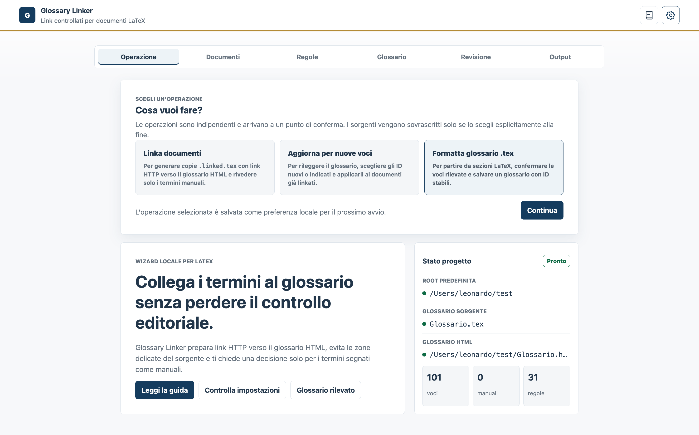
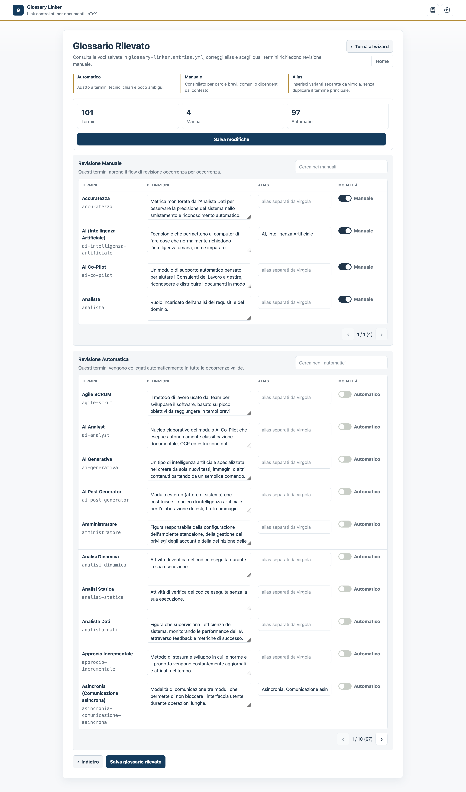
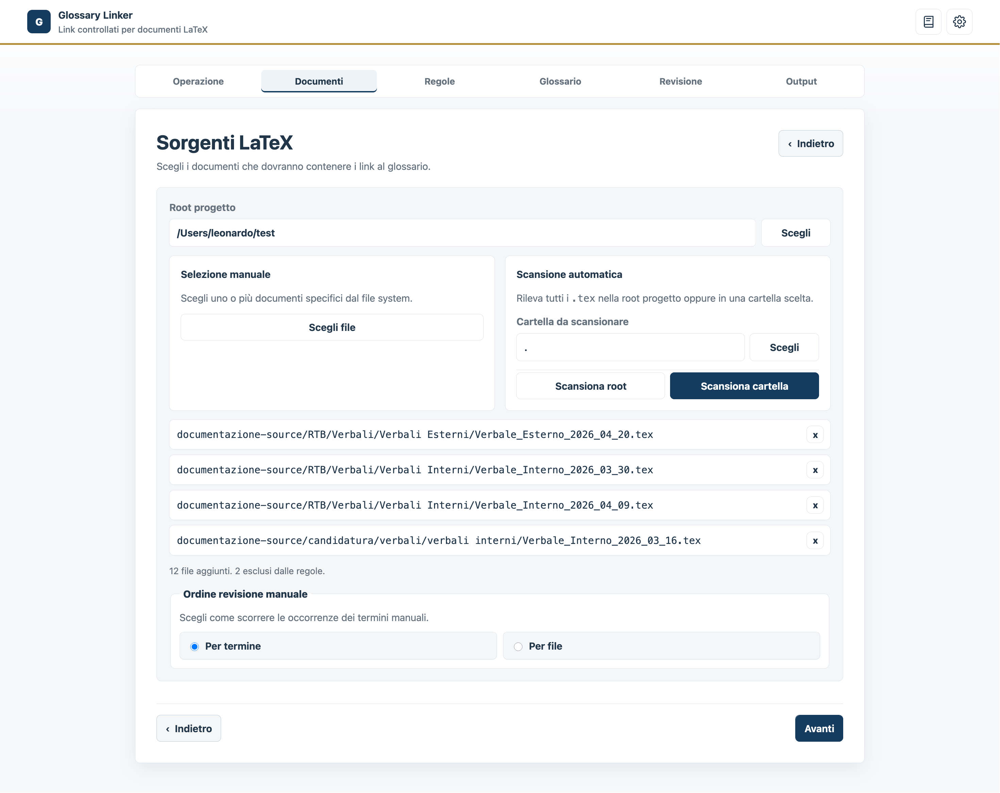
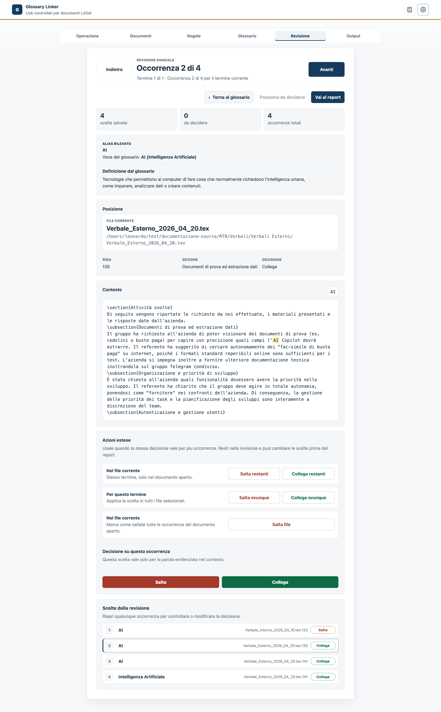
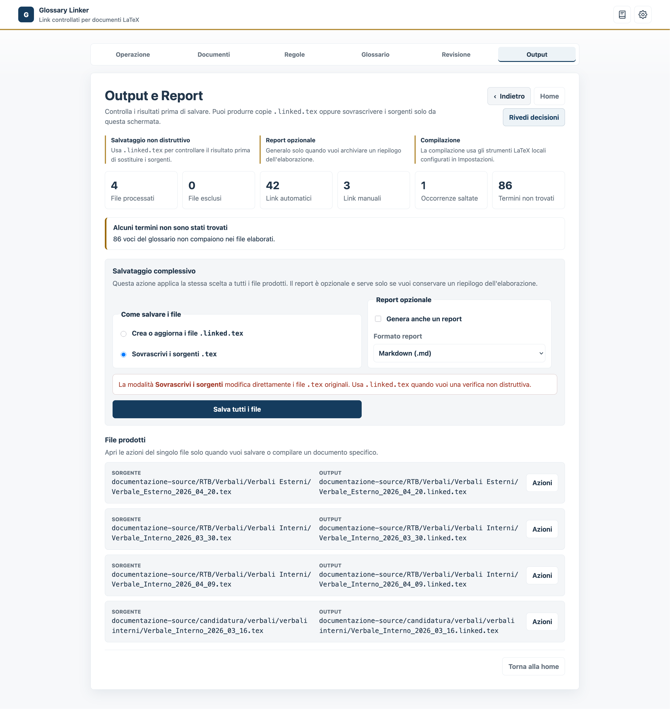
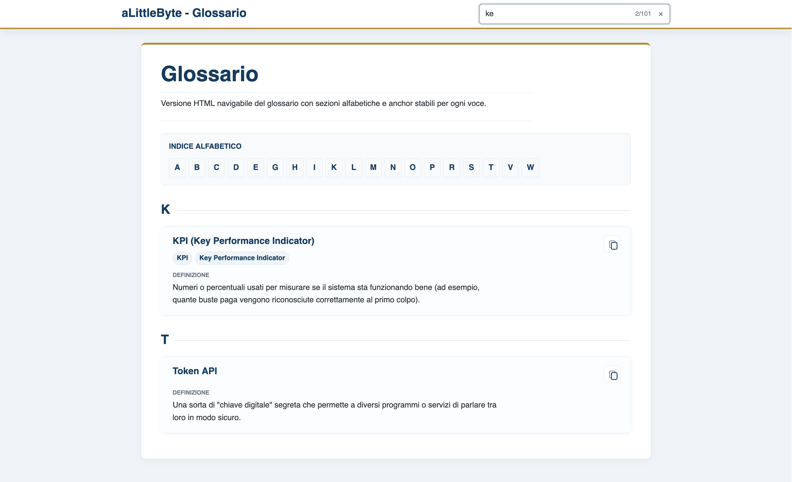

# Glossary Linker - Guida utente

Glossary Linker serve a collegare documenti LaTeX a un glossario HTML, mantenendo controllo editoriale sulle occorrenze ambigue. L'app lavora in locale, salva lo stato del job su disco e non modifica i sorgenti finche non scegli esplicitamente cosa salvare nella schermata finale.


*La schermata iniziale permette di scegliere l'operazione da eseguire e mostra lo stato attuale del progetto.*

## Prima configurazione

Apri le impostazioni dall'icona in alto a destra e controlla l'ambiente locale: root del progetto, porta del server, path di `latexmk`, `pdflatex`, `xelatex` e `lualatex`. La sezione `Verifica ambiente` ti dice se i binari configurati sono raggiungibili.

Le impostazioni personali restano in `glossary-linker.local.yml`. Le regole editoriali condivise stanno invece in `glossary-linker.yml`: pattern di file esclusi, ambienti LaTeX ignorati, comandi da non analizzare e blocchi come indice, frontespizio o titoli.

Se non sai quale compilatore scegliere, lascia `latexmk`.

## Preparare il glossario

Usa `Formatta glossario .tex` quando il glossario sorgente deve essere letto e trasformato in una lista di voci con ID stabili. Puoi selezionare un file locale oppure incollare il contenuto LaTeX.

Il rilevamento puo essere automatico, basato su `\subsection{Termine}` oppure su un comando specifico nel formato `\comando{Termine}`. Dopo il rilevamento controlla le voci: escludi i falsi positivi, correggi le definizioni e aggiungi alias separati da virgola.


*Revisione delle voci rilevate: è possibile impostare alias, definizioni e la modalità di collegamento (automatica o manuale).*

Alla fine il tool salva il glossario HTML. Ogni voce ha un anchor `gls-id`, usato dai link inseriti nei documenti.

Esempio minimo:

```tex
\subsection{Accuratezza}
Metrica che misura quanto una previsione e corretta.
```

## Linkare documenti

L'operazione `Linka documenti` guida il processo in piu step: scelta dei file, regole, glossario, revisione manuale e output. Puoi selezionare singoli `.tex` oppure scansionare una cartella dentro la root del progetto.


*Step di selezione dei file .tex da processare e scelta dell'ordine di revisione.*

Nel passo Glossario controlli l'URL usato dai documenti, le definizioni, gli alias e la modalita delle voci. Le voci automatiche vengono linkate nelle occorrenze valide; le voci manuali entrano nella revisione occorrenza per occorrenza.

Quando un job e gia partito, la rilevazione automatico/manuale resta bloccata nello snapshot corrente. Puoi correggere il glossario per i processi futuri, ma per cambiare quelle modalita nel job in corso devi chiuderlo e ripartire.

Per lavorare in locale lascia:

```text
http://127.0.0.1:8765/glossary-html
```

Per la pubblicazione usa invece l'URL remoto dello stesso file HTML generato, mantenendo l'anchor `#gls-id`.

## Revisione manuale

La revisione mostra una occorrenza alla volta: termine o alias rilevato, definizione dal glossario, file, riga, sezione e contesto con parola evidenziata.


*Controllo editoriale delle occorrenze: il contesto permette di decidere se collegare o saltare il termine.*

`Collega` e `Salta` salvano la scelta e avanzano all'occorrenza successiva nell'ordine di revisione. `Prossima da decidere` salta alle occorrenze ancora senza scelta. Le azioni estese applicano la stessa decisione al termine corrente, al file corrente o a tutte le occorrenze compatibili.

Quando arrivi all'ultima occorrenza, l'app salva la scelta e suggerisce di passare al report finale.

## Output e salvataggio

La schermata finale genera i risultati e il report. Il salvataggio standard produce file `.linked.tex`, utili per controllare il risultato senza toccare gli originali. La sovrascrittura dei sorgenti e disponibile solo come scelta esplicita nella schermata finale.


*Schermata di output con statistiche di elaborazione e pulsanti per il salvataggio dei file e del report.*

Il report puo essere salvato in Markdown o JSON. Serve soprattutto per tracciare file processati, link automatici, link approvati manualmente, occorrenze saltate, warning ed errori.

## Glossario HTML

Il glossario HTML generato e pensato per essere visitabile anche da persone che non usano il tool. Mostra il brand, una ricerca rapida, un indice alfabetico e le voci con definizione e alias. Gli ID tecnici restano negli anchor, ma non sono mostrati direttamente nella pagina.


*Il glossario finale navigabile, con ricerca e navigazione alfabetica.*

Dopo ogni modifica importante al glossario `.tex`, rigenera l'HTML prima di pubblicarlo o usarlo nei documenti finali.

## Problemi comuni

Se il glossario rileva voci sbagliate, cambia metodo di parsing o indica il comando LaTeX corretto. Se la voce e comunque un falso positivo, escludila prima del salvataggio.

Se la compilazione PDF fallisce, controlla il log: di solito il problema e un binario LaTeX non trovato, un pacchetto mancante, un asset assente o un documento che compila solo dalla root originale.

Se un link apre il glossario ma non arriva alla voce giusta, rigenera l'HTML e verifica che esista l'elemento `id="gls-id"` della voce interessata. In locale tieni il server aperto su `http://127.0.0.1:8765`; in remoto assicurati che il file pubblicato sia aggiornato.

Se non sai se una voce deve essere automatica o manuale, usa Manuale per parole corte, comuni o ambigue. Usa Automatico per termini tecnici chiari e poco ambigui.
